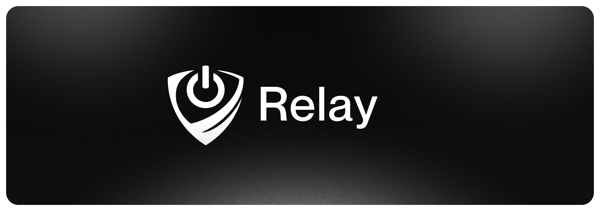

<h1 id="start-of-content" align="center">
  <a id="start-of-content" target="_blank"></a>
</h1>
<p align="center"><strong>Control your devices from anywhere.</strong></p>


<p align="center">
<a href="#-features">⭐ Features</a> •
<a href="#-self-hosting">🏡 Self Hosting</a> •
<a href="#-using-agent">🔌 Using Agent</a>
</p>

## ⭐ Features

- Power actions for **Windows**, **Linux**, and **macOS**
- **Wake-on-LAN** support
- See which devices are **online** or **offline** in real time
- Clean and simple **UI**
- Lightweight **Electron** app for your devices
- **Export** or **Import** your data as a single **Relay** backup file
- *And much more...!*

## 🏡 Self Hosting

### `📦 Manual installation`

### 1. Clone the project

First, download Relay and enter the project folder:
```bash
git clone https://github.com/QuintixLabs/Relay.git
cd Relay
```

### 2. Install Relay
Use one of these:

```bash
npm install
```

### 3. Start Relay
**Development (auto-reload) :**
```bash
npm run dev
```

**Production:**
```bash
npm start
```

By default, the command runs at: [http://127.0.0.1:3010](http://127.0.0.1:3010). You can change this by setting the **PORT** value in `.env`.

#

### `🐋 Docker`

Run Relay via Docker:

```bash
docker run -d \
  --name relay \
  -p 3010:3010 \
  -v $(pwd)/config:/app/config \
  ghcr.io/quintixlabs/relay:latest
```

Or use our [docker-compose.yml](https://github.com/QuintixLabs/Relay/blob/master/docker-compose.yml), which is simpler. Just run:

```bash
docker compose up -d
```

> [!IMPORTANT]
> Before setting up **[Relay Agent](https://github.com/QuintixLabs/Relay-Agent)**, make sure the device you want to control can actually reach your **Relay Hub**.
>
> If that device cannot open your Hub URL, pairing will *fail*

<details open>
<summary><strong>⭐ Recommended: Reach Relay Hub over Tailscale</strong></summary>

<br />

This is the easiest and safest setup for most people.

1. Install [Tailscale](https://tailscale.com/) on the machine running **Relay Hub**
2. On the machine running Relay Hub, open [Tailscale](https://tailscale.com/) and copy its **Tailscale IP**
3. Now check that the Hub opens on that address, for example `http://YOUR_HUB_TAILSCALE_IP:3010`
4. If it opens, use that address in Relay Agent as your **Hub URL** and move to the [next step](#-using-agent)

</details>

<details>
<summary><strong>⚠️ Not Recommended: Expose Relay Hub publicly</strong></summary>

<br />

You can also expose the Hub publicly with a domain, but we do **not** recommend this unless you know exactly what you are doing.

1. Expose **Relay Hub** with a reverse proxy, tunnel, or public HTTPS domain
2. Now, check that the Hub opens on that public address, for example `https://relay.example.com`
3. If it opens, use that address in Relay Agent as your **Hub URL** and move to the [next step](#-using-agent)

</details>

## 🔌 Using Agent

After your Hub is running, the next step is to install [Relay Agent](https://github.com/QuintixLabs/Relay-Agent) on the device you want to control.

### 1. Download Relay Agent

Download the Electron app for your OS below:

| OS | Download |
|----|---------|
| 🪟 Windows | [Download](https://relay-downloads.netlify.app/windows) |
| 🍎 macOS | [Download](https://relay-downloads.netlify.app/macos) |
| 🐧 Linux | [Download](https://relay-downloads.netlify.app/linux) |

> [!IMPORTANT]  
> Relay Agent listens on its local port (`0.0.0.0`) and can be reached through any valid network address on that machine.
>
> That means the Hub needs a real reachable address for that device.

#

### 2. Choose how the Hub will reach the device

You have `2` main ways to do this:

<details open>
<summary><strong>⭐ Recommended: Tailscale</strong></summary>

<br />

This is the easiest and safest setup for most people.

How it works:

1. Install [Tailscale](https://tailscale.com/) on the machine running Relay Agent
2. On the device Relay will control, open [Tailscale](https://tailscale.com/) and copy its **Tailscale IP**
3. Open Relay Agent on that same device, then check `http://YOUR_TAILSCALE_IP:3020/health`
4. If it responds, you'll use that IP in Relay Hub as the device **Tailscale IP / Host** when adding your first device
5. Now move on to the next step, which is [adding your first device in the Hub](#3-add-the-device-in-relay-hub).

</details>

<details>
<summary><strong>⚠️ Not Recommended: Expose the device online</strong></summary>

<br />

You can also expose the device publicly with a domain or public IP, but we do **not** recommend this unless you know exactly what you are doing.

How it works:

1. Open Relay Agent on the device you want to control, then check [http://127.0.0.1:3020/health](http://127.0.0.1:3020/health)
2. Expose [http://127.0.0.1:3020](http://127.0.0.1:3020) through a tunnel, reverse proxy, or forwarded public endpoint
3. If it responds, keep the public domain or public IP from that setup ready. You'll use it in Relay Hub as the device **Tailscale IP / Host**.
4. Now move on to the next step, which is [adding your first device in the Hub](#3-add-the-device-in-relay-hub).


**If you do this:**

- Use **HTTPS**
- Secure the endpoint properly
- Understand that public exposure is riskier than **Tailscale**

</details>

#

### 3. Add the device in Relay Hub

Open Relay Hub in your browser and then click on the `+` in the top right to **Add a device**.

You will mainly fill in:

- **Name** = Choose any name you want for that device
- **Space** = Choose the space you want it to belong to, mainly for organizing devices
- **Tailscale IP / Host** = Use the reachable address you chose earlier, such as a Tailscale IP or public domain
- **Agent token** = Agent Token is like a password so put a password for your device
- **MAC address** = Optional, only needed if you want to wake that device from Relay

<details>
<summary><strong>🖧 How to find your MAC address</strong></summary>

<br />

#### `Windows`

Open **Command Prompt** or **PowerShell** and run:

```powershell
getmac /v
```

Look for the active adapter and copy its **Physical Address**.

#### `macOS`

Open Terminal and run:

```bash
ifconfig
```

Look for the active network interface and copy the `ether` value.

#### `Linux`

Open Terminal and run:

```bash
ip link
```

Look for the active network interface and copy the `link/ether` value.

</details>

Relay Agent will sync the real OS and live port on its own after it connects.

#

### 4. Pair the device in Relay Agent

After the device exists in Relay Hub, finish pairing inside Relay Agent.

You have 2 setup options:

<details open>
<summary><strong>✍️ Set up manually</strong></summary>

<br />

Use this if you want to type everything yourself.

Fill in:

- **Hub URL** = your Relay Hub address
- **Agent token** = the token from the device you added in Relay Hub
- **Port** = the local Relay Agent port, usually `3020`

</details>

<details>
<summary><strong>📄 Import config</strong></summary>

<br />

Use this if you want a faster setup.

In Relay Hub, click the **download** button on that device row to download its config file, then import it in Relay Agent.

This fills the pairing details for you automatically.

</details>

#

### 5. Done

After pairing:

- Relay Agent connects to your Hub
- the Hub should show the device $\color{Green}{\textsf{Online}}$
- you can now control that device from Relay

That is the full setup `;]`


## 📄 License
[](http://www.gnu.org/licenses/gpl-3.0.en.html)

Relay is [Free Software](https://en.wikipedia.org/wiki/Free_software): You can use, study, share and modify it at your will. The app can be redistributed and/or modified under the terms of the
[GNU General Public License version 3](https://www.gnu.org/licenses/gpl.html) published by the 
[Free Software Foundation](https://www.fsf.org/).

<div align="right">
<table><td>
<a href="#start-of-content">↥ Scroll to top</a>
</td></table>
</div>
